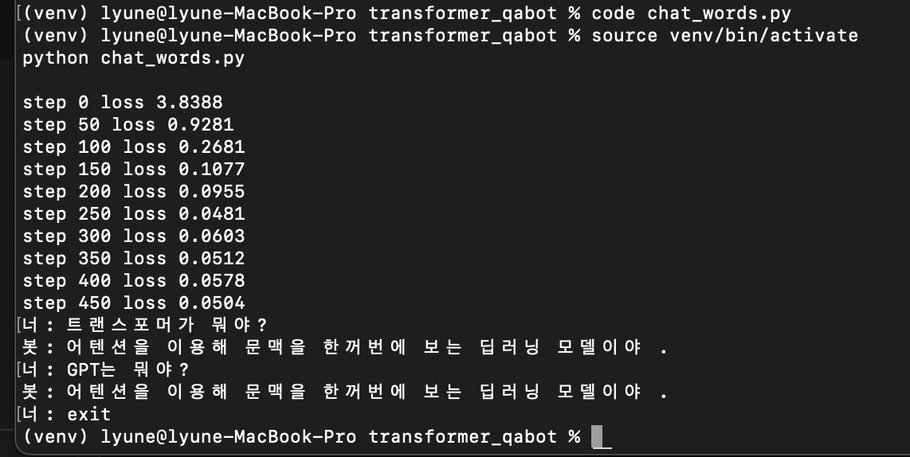

# Transformer Q/A Chatbot (학습용 프로젝트)

이 프로젝트는 **Transformer 구조를 직접 구현**해서  
간단한 Q/A 데이터셋을 학습시키고 챗봇처럼 질의응답을 해보는 실습용 예제입니다.

---


## 📂 디렉토리 구조

```text
transformer_qabot/
├── data.txt                  # Q/A 학습 데이터
├── my_tokenizer.py           # 단어 단위 토크나이저(표준 tokenize 모듈과 충돌 방지)
├── train_qabot_words.py      # 단어 단위 Q/A 학습 스크립트(Transformer)
├── chat_words.py             # 학습된 모델 로드 후 질의응답 실행
├── requirements.txt          # 의존성 (torch, numpy)
├── README.md                 # 이 문서
├── .gitignore                # venv, .env, *.pt 등 제외
├── qabot_words.pt            # (학습 후 생성) 모델 가중치
├── train_qabot.py            # (옵션) 문자 단위 학습 스크립트
├── chat.py                   # (옵션) 문자 단위 생성 실행
└── venv/, __pycache__/       # 자동 생성(업로드 제외)

🚀 실행 방법 (macOS / zsh)

1) 가상환경 & 의존성

cd ~/transformer_qabot
python3 -m venv venv
source venv/bin/activate
pip install -r requirements.txt


# Transformer Q/A Chatbot (학습용)

직접 구현한 **Transformer 블록**으로 작은 Q/A 데이터셋을 학습시키고, 간단한 질의응답을 수행하는 예제입니다.  
목표: “작게 만들어서 동작 원리를 이해”하는 것.

---

## 📂 디렉토리 구조 (예시)

transformer_qabot/
├── data.txt # Q/A 학습 데이터
├── my_tokenizer.py # 단어 단위 토크나이저(표준 tokenize 충돌 방지)
├── train_qabot_words.py # 단어 단위 Q/A 학습 스크립트(Transformer)
├── chat_words.py # 학습된 모델로 질의응답 실행
├── requirements.txt # 의존성 (torch, numpy)
├── README.md # 이 문서
├── .gitignore # venv, .env, *.pt 등 제외
├── qabot_words.pt # (학습 후 생성) 단어 단위 모델 가중치
├── train_qabot.py # (옵션) 문자 단위 학습 스크립트
├── chat.py # (옵션) 문자 단위 생성 실행
└── pycache/ , venv/ # (자동 생성 / 업로드 제외 대상)

> 참고: `qabot_words.pt`는 학습이 끝나면 생성됩니다. 모델 파일은 `.gitignore`에 포함하는 걸 권장합니다.

---

## 🔧 요구사항

- Python 3.10+
- pip로 설치 가능한 환경

```bash
python3 -m venv venv
source venv/bin/activate
pip install -r requirements.txt   # torch, numpy
🧾 데이터 형식 (data.txt)
아주 작은 Q/A 쌍을 단순 텍스트로 둠:
Q: 트랜스포머가 뭐야?
A: 어텐션을 이용해 문맥을 한꺼번에 보는 딥러닝 모델이야.

Q: 트랜스포머의 장점은?
A: 병렬 학습이 가능하고 긴 의존 관계를 잘 학습할 수 있어.

Q: 트랜스포머의 단점은?
A: 계산량이 많고 긴 입력 처리에 비효율적이야.

Q: BERT는 뭐야?
A: 트랜스포머 인코더 기반의 언어 이해 모델이야.

Q: GPT는 뭐야?
A: 트랜스포머 디코더 기반의 언어 생성 모델이야.
원하면 Q/A 접두어(Q:, A:)를 제거한 포맷으로 바꿀 수 있음. 그러면 출력이 더 “답변만”에 가깝게 나온다.
🧠 모델 개요
토큰화: my_tokenizer.py – 정규식 기반 단어 단위 토큰화
아키텍처: 디코더형 Transformer
Causal Self-Attention(미래 마스크)
Multi-Head Attention → FFN
LayerNorm + Residual
Positional Embedding(고정 길이)
학습 목표: 다음 토큰 예측(언어모델 방식)으로 Q/A 패턴 습득
⚙️ 하이퍼파라미터(기본값)
train_qabot_words.py:
block_size = 16 (한 번에 보는 단어 길이)
n_embed = 128, n_head = 4, n_layer = 2
batch_size = 16, max_iters = 500
learning_rate = 3e-4, dropout = 0.1
느리면 n_layer=1, n_embed=64, max_iters=200으로 줄여서 가볍게 돌릴 수 있음.
🚀 실행
1) 학습
python train_qabot_words.py
종료 시 qabot_words.pt 저장
2) 대화
python chat_words.py
입력: 평문 질문
내부 입력 형식: "q: {질문} a:"로 프롬프트 구성 후 생성
출력 길이 조절: chat_words.py의 max_new_tokens 값(기본 30)을 80~100 등으로 늘리면 더 김.
📈 학습 로그 예시
실행 중 콘솔 출력(예시):
step 0 loss 3.9079
step 50 loss 0.8625
step 100 loss 0.3361
step 150 loss 0.1027
step 200 loss 0.0647
step 250 loss 0.0462
step 300 loss 0.0489
step 350 loss 0.0426
step 400 loss 0.0465
step 450 loss 0.0540
손실이 빠르게 떨어지며, 작은 데이터셋에서는 거의 “암기”에 가까운 패턴 학습이 일어남.
과적합/진동이 보이면 dropout을 0.1→0.2로 높이거나 max_iters를 조절.
💬 실행 예시
너: 트랜스포머가 뭐야?
봇: q : 트랜스포머가 뭐야 ? a : 어텐션을 이용해 문맥을 한꺼번에 보는 딥러닝 모델이야 . q : 트랜스포머의 장점은 ? a : 병렬 학습이 가능하고 긴 의존 관계를 잘 학습할 수 있어 . q : 트랜스포머의 단점은
뒤에 다른 Q/A까지 이어지는 이유:
데이터가 매우 작아 패턴을 통째로 생성하는 경향.
max_new_tokens가 짧아 중간에 잘릴 수 있음.
개선 팁:
max_new_tokens를 80~100으로 늘림.
data.txt에서 Q:/A: 접두어를 제거해 “답변만” 나오도록 유도.
Q/A 쌍을 더 추가해서 패턴 일반화.
===========================================================

2) 데이터 확인/수정

data.txt에 Q/A 샘플이 포함되어 있습니다(자유롭게 추가/수정).

===========================================================

3) 학습

python train_qabot_words.py

예시 로그:
step 0 loss 3.90
...
step 450 loss 0.05

완료 후 qabot_words.pt 생성.

===========================================================

4) 실행(대화)

python chat_words.py

예시 입력:
너: 트랜스포머가 뭐야?
너: GPT는 뭐야?
종료: exit / quit 또는 Ctrl+C / Ctrl+D

## 실행 화면

      
