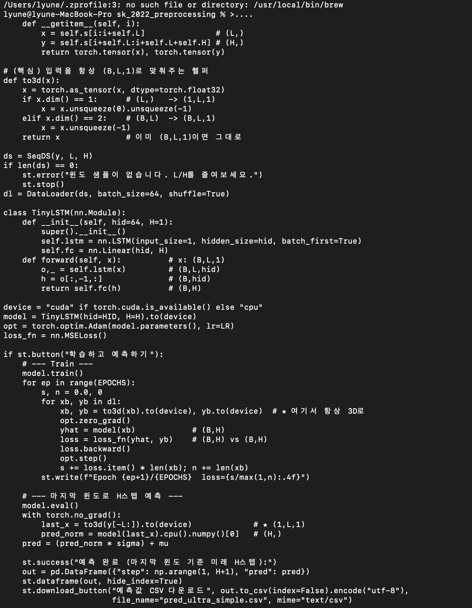

# Transformer Q/A Chatbot (학습용)

직접 구현한 **Transformer 블록**으로 작은 Q/A 데이터셋을 학습시키고, 간단한 질의응답을 수행하는 예제입니다.  
목표: “작게 만들어서 동작 원리를 이해”하는 것.

---

## 📂 디렉토리 구조

```text
transformer_qabot/
├── data.txt                  # Q/A 학습 데이터 (Q: / A: 포맷)
├── my_tokenizer.py           # 단어 단위 토크나이저
├── train_qabot_words.py      # 학습 스크립트 (TransformerLM)
├── chat_words.py             # 학습된 모델로 질의응답 실행
├── requirements.txt          # 의존성 (torch, numpy, joblib)
├── README.md                 # 프로젝트 문서
├── .gitignore                # venv, .env, *.pt 등 제외
├── qabot_words.pt            # (학습 후 생성) 모델 가중치
├── stoi.pkl / itos.pkl       # (학습 후 생성) vocab 사전
├── docs/
│   └── transformer_demo.png  # 실제 실행 화면 캡쳐
└── venv/, __pycache__/       # 자동 생성(업로드 제외)

🧾 데이터 형식 (data.txt)
학습 데이터는 Q:와 A: 접두어를 사용합니다:
Q: 트랜스포머가 뭐야?
A: 어텐션을 이용해 문맥을 한꺼번에 보는 딥러닝 모델이야.

Q: GPT는 뭐야?
A: 트랜스포머 디코더 기반의 언어 생성 모델이야.

Q: BERT는 뭐야?
A: 트랜스포머 인코더 기반의 언어 이해 모델이야.
...

🚀 실행 방법
1) 학습
python train_qabot_words.py
실행 중 콘솔 로그 예시:
step 0 loss 5.3904
step 50 loss 3.8618
...
step 450 loss 0.0870

✅ 모델과 vocab 저장 완료: qabot_words.pt, stoi.pkl, itos.pkl
2) 대화
python chat_words.py
실행 예시:
너: 트랜스포머가 뭐야?
봇: 어텐션을 이용해 문맥을 한꺼번에 보는 딥러닝 모델이야.

너: GPT는 뭐야?
봇: 트랜스포머 디코더 기반의 언어 생성 모델이야.

너: exit
대화 종료!


📸 실행 화면
<p align="center">  </p>