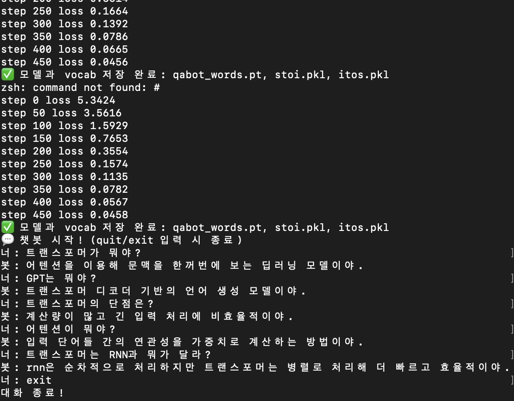

# Transformer Q/A Chatbot (학습용 프로젝트)

직접 구현한 **Transformer 블록**으로 작은 Q/A 데이터셋을 학습시키고, 간단한 질의응답을 수행하는 예제입니다.  
목표: “작게 만들어서 동작 원리를 이해”하는 것.

---

## 📂 디렉토리 구조

```text
transformer_qabot/
├── data.txt             # Q/A 학습 데이터
├── my_tokenizer.py      # 단어 단위 토크나이저 (표준 tokenize 충돌 방지)
├── train_qabot_words.py # 단어 단위 Q/A 학습 스크립트 (Transformer)
├── chat_words.py        # 학습된 모델 로드 후 질의응답 실행
├── requirements.txt     # 의존성 (torch, numpy)
├── README.md            
├── .gitignore           # venv, .env, *.pt 등 제외
├── qabot_words.pt       # (학습 후 생성) 모델 가중치
├── train_qabot.py       # (옵션) 문자 단위 학습 스크립트
├── chat.py              # (옵션) 문자 단위 생성 실행
└── venv/, __pycache__/  # 자동 생성 (업로드 제외)

> 참고: `qabot_words.pt`는 학습이 끝나면 생성됩니다.

🚀 실행 방법
1) 환경 세팅
python3 -m venv venv
source venv/bin/activate
pip install -r requirements.txt
2) 학습
python train_qabot_words.py
종료 후 qabot_words.pt 모델 파일이 생성됩니다.
3) 대화 실행
python chat_words.py
입력: 평문 질문
내부 입력 형식: "q: {질문} a:"
출력 길이 조절: chat_words.py의 max_new_tokens 값 (기본 30 → 80~100 권장)
📈 학습 로그 예시
step 0 loss 3.9079
step 50 loss 0.8625
step 100 loss 0.3361
step 150 loss 0.1027
...
step 450 loss 0.0540
작은 데이터셋에서는 손실이 빠르게 떨어지며, 거의 “암기”에 가까운 학습이 일어납니다.
과적합이 보이면 dropout을 0.2로 높이거나 max_iters를 조절하세요.
💬 실행 예시
너: 트랜스포머가 뭐야?
봇: 어텐션을 이용해 문맥을 한꺼번에 보는 딥러닝 모델이야.

너: GPT는 뭐야?
봇: 트랜스포머 디코더 기반의 언어 생성 모델이야.
뒤에 Q/A까지 이어지는 문제: 데이터셋이 너무 작아 발생
해결 팁:
max_new_tokens 값을 늘려 출력 길이 확보
data.txt에서 Q:/A: 접두어 제거 → 답변만 나오도록 유도
Q/A 쌍을 더 추가


